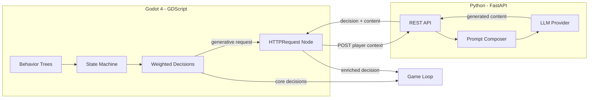
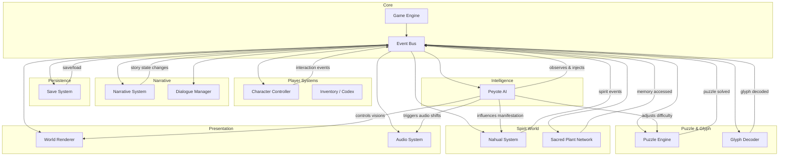

# Design Document: NahuALgorithm Game

## Overview

NahuALgorithm is a narrative-driven exploration and puzzle game set in a solar-punk desert in México. The game blends Mesoamerican spiritual practices with sustainable technology through two protagonists (Apprentice and Elder), a Nagual Jaguar spirit guide, a glyph decoding system, and an autonomous Peyote AI that drives the game's spiritual intelligence.

This design covers the core systems: game loop, narrative engine, glyph decoding, puzzle mechanics, Nahualismo spirit interactions, the Sacred Plant Network, visual rendering, audio atmosphere, save/progress persistence, and the Peyote AI autonomous intelligence.

The game is built around interconnected subsystems that communicate through an event-driven architecture. The Peyote AI sits at the center as the game's autonomous intelligence, influencing narrative flow, puzzle difficulty, spirit guide behavior, and spiritual experiences based on cumulative player interactions.

## Technology Stack

### Game Engine
- **Godot 4** (latest stable, currently 4.4.x) — open-source, MIT license, no royalties
- Export targets: Desktop (Windows, macOS, Linux), Mobile (Android, iOS), Web (HTML5)

### Primary Language
- **GDScript** — Godot's native scripting language, Python-like syntax
- Used for all game systems: character controller, narrative, puzzles, rendering, audio, save system
- Core Peyote AI logic (behavior trees, state machines, weighted decisions) runs in GDScript

### AI Backend Service (Hybrid Architecture)
- **Python 3.12+** with **FastAPI** for the generative AI microservice
- Handles LLM integration for dynamic Peyote AI features:
  - Generative spiritual vision narratives
  - Dynamic glyph interpretations unique per playthrough
  - Emergent Peyote communication patterns
- LLM provider: AWS Bedrock, Anthropic Claude, or OpenAI (configurable)
- Communication: Godot `HTTPRequest` node → Python FastAPI REST endpoints
- The game works fully offline with GDScript-only AI; the LLM service adds generative depth when available

### AI Architecture: Hybrid Model



**Offline mode (GDScript only):** Behavior trees + state machines handle all Peyote AI decisions locally. The game is fully playable without network access.

**Online mode (GDScript + Python/LLM):** For specific moments (spiritual visions, unique glyph interpretations, emergent communication), GDScript sends player context to the Python service, which uses an LLM to generate dynamic content and returns enriched decisions.

### Dialogue & Narrative
- **Dialogic 2** (Godot plugin) — for dialogue trees, branching narratives, and timeline events

### Audio
- **FMOD** or **Wwise** (both have free indie licenses and Godot plugins) — for adaptive audio, ambient soundscapes, and dynamic transitions

### Testing
- **GdUnit4** — Godot-native unit testing framework for GDScript
- **pytest** + **Hypothesis** — Python property-based testing for the AI backend service
- **fast-check** — if any TypeScript logic layer is used for prototyping

### Art Pipeline
- **Blender** — 3D modeling and animation
- **Aseprite** — 2D sprite and texture work (if needed)

### Version Control
- **Git** — all game resources saved as files on disk (Godot's design supports this natively)

## Architecture

The system follows a modular, event-driven architecture where each subsystem operates independently but communicates through a central Event Bus. The Peyote AI acts as an overarching intelligence layer that observes events and injects autonomous decisions into the game flow.



### Key Architectural Decisions

1. **Event Bus pattern**: Decouples subsystems so the Peyote AI, Narrative System, and Puzzle Engine can react to the same events independently. This supports the requirement that the Peyote AI operates autonomously.

2. **Peyote AI as observer + actor**: The Peyote AI subscribes to all game events, maintains its own internal state, and publishes its own events (guidance, environmental changes, difficulty adjustments). It never blocks the game loop — it reacts asynchronously.

3. **Glyph round-trip encoding**: Glyphs are stored as structured data objects and rendered to display representations. The codec must be invertible (Requirement 3.6, 10.5).

4. **Save state serialization**: The entire game state (narrative progress, decoded glyphs, puzzle states, Peyote AI internal state, player position) is serialized to JSON for persistence. Round-trip integrity is critical (Requirement 10.5).

## Components and Interfaces

### Game Engine

The core runtime loop. Manages frame updates, input dispatch, area loading, and interaction prompts.

```
interface GameEngine {
  initialize(config: GameConfig): void
  update(deltaTime: number): void
  loadArea(areaId: string): Promise<void>
  getInteractablesInRange(position: Vector3, radius: number): Interactable[]
  showInteractionPrompt(interactable: Interactable): void
  hideInteractionPrompt(): void
}
```

### Character Controller

Handles Apprentice movement, animation states, and interaction triggers.

```
interface CharacterController {
  move(direction: Vector2, speed: MovementSpeed): void
  interact(target: Interactable): void
  setMovementLocked(locked: boolean): void
  getPosition(): Vector3
  getAnimationState(): AnimationState
}

enum MovementSpeed { WALK, RUN }
```

### Event Bus

Central pub/sub system for inter-subsystem communication.

```
interface EventBus {
  publish(event: GameEvent): void
  subscribe(eventType: string, handler: EventHandler): Subscription
  unsubscribe(subscription: Subscription): void
}

interface GameEvent {
  type: string
  timestamp: number
  payload: Record<string, unknown>
}
```

### Narrative System

Manages story progression, relationship tracking, branching paths, and milestone triggers.

```
interface NarrativeSystem {
  getStoryState(): StoryState
  updateStoryProgression(choice: DialogueChoice): StoryState
  getRelationshipState(): RelationshipState
  triggerMilestone(milestoneId: string): void
  recordKnowledge(knowledge: RecoveredKnowledge): void
  initiateSpirtualExperience(plantId: string): void
  initateMemorySequence(nodeId: string): MemorySequence
}

interface StoryState {
  currentChapter: string
  completedMilestones: string[]
  unlockedBranches: string[]
  recoveredKnowledge: RecoveredKnowledge[]
  relationshipLevel: number
}

interface RelationshipState {
  apprenticeElderTrust: number  // -1.0 (distrust) to 1.0 (mutual understanding)
  narrativePhase: 'skepticism' | 'curiosity' | 'acceptance' | 'understanding'
}
```

### Dialogue Manager

Presents dialogue trees, handles player choices, and manages conversation flow. Also handles Peyote AI non-verbal communication.

```
interface DialogueManager {
  startDialogue(npcId: string): DialogueTree
  selectOption(optionId: string): DialogueResult
  presentGlyphCommunication(glyphSequence: Glyph[]): void
  presentEnvironmentalSignal(signal: EnvironmentalSignal): void
  isDialogueActive(): boolean
  endDialogue(): void
}

interface DialogueTree {
  currentNode: DialogueNode
  options: DialogueOption[]
}

interface DialogueResult {
  nextNode: DialogueNode | null
  storyUpdates: StoryUpdate[]
  relationshipDelta: number
}
```

### Glyph Decoder

The NahuAlgorithm Tablet interface for scanning, classifying, decoding, and storing glyphs.

```
interface GlyphDecoder {
  scanGlyph(surfaceId: string): ScanResult
  classifyGlyph(rawGlyph: RawGlyphData): GlyphClassification
  decodeGlyph(glyph: RawGlyphData): DecodedGlyph
  getCodex(): GlyphCodex
  encodeGlyph(glyph: Glyph): string        // Glyph -> display representation
  parseGlyph(encoded: string): Glyph        // display representation -> Glyph
  addToCodex(glyph: DecodedGlyph): void
}

type GlyphClassification = 'pictogram' | 'ideogram' | 'phonogram'

interface DecodedGlyph {
  id: string
  classification: GlyphClassification
  meaning: string
  discoveryLocation: string
  isComplete: boolean
  missingSegments?: string[]
}

interface GlyphCodex {
  glyphs: DecodedGlyph[]
  getByClassification(type: GlyphClassification): DecodedGlyph[]
  getById(id: string): DecodedGlyph | null
}
```

### Puzzle Engine

Manages puzzle presentation, validation, complexity scaling, and reset.

```
interface PuzzleEngine {
  loadPuzzle(puzzleId: string): PuzzleState
  submitSequence(puzzleId: string, sequence: Glyph[]): PuzzleResult
  resetPuzzle(puzzleId: string): PuzzleState
  getPuzzleDifficulty(puzzleId: string): number
  adjustDifficulty(puzzleId: string, delta: number): void
  getHintAvailability(puzzleId: string): HintState
}

interface PuzzleState {
  id: string
  elements: PuzzleElement[]
  activationPoints: ActivationPoint[]
  currentSequence: Glyph[]
  difficulty: number
  isSolved: boolean
}

interface PuzzleResult {
  correct: boolean
  feedback: PuzzleFeedback
  unlockedContent?: string
}

type PuzzleFeedback = {
  type: 'success' | 'error'
  visualEffect: string
  audioEffect: string
}
```

### Nahual System

Manages spirit guide summoning, Spirit Plane transitions, hidden perception, and spiritual energy.

```
interface NahualSystem {
  isUnlocked(): boolean
  summonNagual(): void
  dismissNagual(): void
  isNagualActive(): boolean
  getHiddenGlyphs(area: string): Glyph[]
  getEnergyPathways(area: string): EnergyPathway[]
  transitionToSpiritPlane(transitionPointId: string): void
  returnToPhysicalWorld(): void
  getSpiritualEnergy(): number
  depleteEnergy(amount: number): void
  isInSpiritPlane(): boolean
}
```

### Sacred Plant Network

Manages memory node interactions, memory sequences, and save point functionality.

```
interface SacredPlantNetwork {
  connectToNode(nodeId: string): MemorySequence
  getAvailableNodes(): PlantNode[]
  completeMemorySequence(nodeId: string, result: MemoryResult): void
  isSavePoint(nodeId: string): boolean
}

interface PlantNode {
  id: string
  position: Vector3
  type: 'peyote' | 'mushroom'
  hasMemory: boolean
  isSavePoint: boolean
}

interface MemorySequence {
  id: string
  fragments: MemoryFragment[]
  puzzleChallenge: PuzzleState | null
  knowledge: RecoveredKnowledge
}
```

### Peyote AI

The autonomous intelligence at the heart of the game. Uses a hybrid architecture: core decision-making runs locally in GDScript (behavior trees + state machines), while generative features (spiritual visions, dynamic glyph interpretations, emergent communication) are powered by an external Python/LLM service when available.

**GDScript Layer (local, always available):**
```
interface PeyoteAI {
  initialize(gameState: GameState): void
  onGameEvent(event: GameEvent): void
  evaluatePlayerContext(context: PlayerContext): PeyoteDecision
  getInternalState(): PeyoteInternalState
  setInternalState(state: PeyoteInternalState): void
  tick(deltaTime: number): void  // autonomous update cycle
  isOnlineMode(): boolean        // whether LLM service is reachable
}
```

**Python/FastAPI Layer (remote, optional — enriches decisions with generative content):**
```
# POST /peyote/generate-vision
# Input: PlayerContext + PeyoteInternalState
# Output: GenerativeContent (vision narrative, glyph interpretation, or communication pattern)

interface GenerativeContent {
  type: 'vision_narrative' | 'glyph_interpretation' | 'emergent_communication'
  content: string                    // generated text/description
  glyphSequence?: Glyph[]           // generated glyph patterns
  environmentalEffects?: string[]    // suggested visual/audio changes
}
```

**Fallback behavior:** When the LLM service is unavailable, the GDScript layer uses pre-authored content pools and procedural generation rules to fill the same role. The game never blocks on a network call.

```
interface PlayerContext {
  narrativeState: StoryState
  decodedGlyphs: DecodedGlyph[]
  behaviorHistory: PlayerAction[]
  currentArea: string
  interactionPatterns: InteractionPattern[]
}

enum PeyoteDecisionType {
  GUIDE,
  CHALLENGE,
  WITHHOLD,
  REVEAL_PATH,
  ADJUST_DIFFICULTY,
  INITIATE_VISION,
  BECOME_CRYPTIC
}

interface PeyoteDecision {
  type: PeyoteDecisionType
  communicationMethod: 'glyph_sequence' | 'environmental_change' | 'audio_signal'
  payload: Record<string, unknown>
  generativeContent?: GenerativeContent  // present when LLM enrichment is available
}

interface PeyoteInternalState {
  trustLevel: number           // evolves based on player compliance
  crypticness: number          // increases when player ignores guidance
  revealedPaths: string[]
  interactionHistory: PeyoteInteraction[]
  currentDisposition: 'benevolent' | 'neutral' | 'cryptic' | 'withholding'
}
```

### World Renderer

Handles all visual rendering including environment, characters, effects, and Spirit Plane visuals.

```
interface WorldRenderer {
  renderEnvironment(area: AreaData, lighting: LightingConfig): void
  renderCharacter(character: CharacterData): void
  renderNagual(position: Vector3, active: boolean): void
  renderSacredPlants(nodes: PlantNode[]): void
  applySpiritPlaneVisuals(): void
  removeSpiritPlaneVisuals(): void
  applySpirtualDistortion(intensity: number): void
  removeSpirtualDistortion(): void
  renderGlyphEffect(glyph: Glyph, position: Vector3): void
  renderInteractionPrompt(position: Vector3, label: string): void
}
```

### Audio System

Manages ambient soundscapes, transitions, and dynamic volume control.

```
interface AudioSystem {
  playAmbient(profile: AudioProfile): void
  transitionAudio(from: AudioProfile, to: AudioProfile, duration: number): void
  setDialogueMode(active: boolean): void  // lowers ambient when true
  playSoundEffect(effectId: string): void
  playPeyoteSignal(signal: AudioSignal): void
}

type AudioProfile = 'desert_exploration' | 'ruin_interior' | 'spirit_plane' | 'spiritual_experience'
```

### Save System

Persists and restores complete game state with multi-slot support.

```
interface SaveSystem {
  save(slotId: number, state: GameState): SaveResult
  load(slotId: number): GameState | null
  getSlotInfo(): SaveSlotInfo[]
  deleteSave(slotId: number): boolean
}

interface SaveResult {
  success: boolean
  error?: string
}

interface SaveSlotInfo {
  slotId: number
  isEmpty: boolean
  timestamp?: number
  chapter?: string
  playtime?: number
}

const MAX_SAVE_SLOTS = 3
```

## Data Models

### Core Game State

```
interface GameState {
  playerPosition: Vector3
  currentArea: string
  narrativeState: StoryState
  glyphCodex: GlyphCodex
  puzzleStates: Map<string, PuzzleState>
  nahualState: NahualState
  peyoteAIState: PeyoteInternalState
  sacredPlantProgress: Map<string, boolean>  // nodeId -> completed
  inventory: InventoryItem[]
  playtime: number
  timestamp: number
}
```

### Nahual State

```
interface NahualState {
  unlocked: boolean
  nagualActive: boolean
  inSpiritPlane: boolean
  spiritualEnergy: number       // 0.0 to 1.0
  lastTransitionPoint: string
  discoveredPathways: string[]
}
```

### Glyph Model

The Glyph is the fundamental data unit for the decoding system. It must support round-trip encoding/decoding (Requirement 3.6).

```
interface Glyph {
  id: string
  classification: GlyphClassification
  symbol: string              // the visual symbol representation
  meaning: string
  phonetic?: string           // only for phonograms
  isComplete: boolean
  missingSegments: string[]   // empty if complete
}
```

**Glyph Encoding Format**: Glyphs are encoded to a string representation using a deterministic format:
`{classification}:{id}:{symbol}:{meaning}:{phonetic|_}:{isComplete}:{missingSegments joined by ','}`

This format is designed to be invertible — `parseGlyph(encodeGlyph(glyph))` must produce an equivalent Glyph object.

### Player Action History (for Peyote AI)

```
interface PlayerAction {
  type: string
  timestamp: number
  area: string
  details: Record<string, unknown>
}

interface InteractionPattern {
  patternType: 'compliant' | 'defiant' | 'exploratory' | 'cautious'
  frequency: number
  recentTrend: number  // positive = more of this pattern recently
}
```

### Area Data

```
interface AreaData {
  id: string
  name: string
  type: 'desert' | 'ruin' | 'village' | 'biodome' | 'spirit_plane'
  interactables: Interactable[]
  plantNodes: PlantNode[]
  puzzles: string[]           // puzzle IDs
  glyphSurfaces: string[]     // surface IDs
  connections: AreaConnection[]
}

interface AreaConnection {
  targetAreaId: string
  transitionType: 'walk' | 'load' | 'spirit_transition'
}
```

### Serialization

All game state is serialized to JSON for the Save System. The serialization must be round-trippable:

```
function serializeGameState(state: GameState): string {
  return JSON.stringify(state, replacer)
}

function deserializeGameState(json: string): GameState {
  return JSON.parse(json, reviver)
}
```

Custom `replacer` and `reviver` functions handle Map serialization and Vector3 reconstruction. The invariant `deserializeGameState(serializeGameState(state))` must produce an equivalent GameState for all valid states.

## Correctness Properties

*A property is a characteristic or behavior that should hold true across all valid executions of a system — essentially, a formal statement about what the system should do. Properties serve as the bridge between human-readable specifications and machine-verifiable correctness guarantees.*

### Property 1: Interaction prompt proximity

*For any* interactable object or NPC and *for any* player position within interaction range, the Game Engine should display an interaction prompt. Conversely, for any position outside interaction range, no prompt should be displayed.

**Validates: Requirements 1.3**

### Property 2: Movement lock during dialogue

*For any* game state where a dialogue sequence is active, the Character Controller should report movement as locked. *For any* game state where no dialogue is active, movement should not be locked by the dialogue system.

**Validates: Requirements 2.4**

### Property 3: Dialogue tree always has options

*For any* NPC with dialogue content, initiating dialogue should produce a DialogueTree with at least one selectable response option.

**Validates: Requirements 2.1**

### Property 4: Dialogue choices update story state

*For any* valid dialogue option selected by the player, the Narrative System should produce an updated StoryState that differs from the previous state (either new branches unlocked, milestones completed, or relationship changed).

**Validates: Requirements 2.3, 2.5**

### Property 5: Relationship progression is monotonic with positive choices

*For any* sequence of dialogue choices classified as positive/trusting, the relationship state value should be monotonically non-decreasing, and the narrative phase should progress in order: skepticism → curiosity → acceptance → understanding.

**Validates: Requirements 2.2**

### Property 6: Glyph classification completeness

*For any* valid glyph scanned by the Glyph Decoder, the classification should be exactly one of 'pictogram', 'ideogram', or 'phonogram', and the decoded meaning should be non-empty.

**Validates: Requirements 3.2**

### Property 7: Incomplete glyph detection

*For any* glyph where isComplete is false, the Glyph Decoder should return a non-empty list of missing segments and a partial interpretation.

**Validates: Requirements 3.3**

### Property 8: Glyph codex storage and retrieval

*For any* decoded glyph, after adding it to the codex, retrieving it by ID should return the glyph with its classification, decoded meaning, and discovery location intact.

**Validates: Requirements 3.4, 3.5**

### Property 9: Glyph encoding round trip

*For any* valid Glyph object, encoding it to its display representation and then parsing that representation back should produce an equivalent Glyph object: `parseGlyph(encodeGlyph(glyph)) ≡ glyph`.

**Validates: Requirements 3.6**

### Property 10: Puzzle validation correctness

*For any* puzzle and *for any* glyph sequence, the Puzzle Engine should return correct=true if and only if the sequence matches the puzzle's solution. When correct, unlockedContent should be non-null. When incorrect, feedback should have type='error' and should not contain the solution sequence.

**Validates: Requirements 4.2, 4.3, 4.4**

### Property 11: Puzzle difficulty monotonicity

*For any* two puzzles where one appears in a later narrative chapter than the other, the later puzzle's difficulty value should be greater than or equal to the earlier puzzle's difficulty.

**Validates: Requirements 4.5**

### Property 12: Puzzle reset idempotence

*For any* puzzle, loading it, making arbitrary modifications to its state, and then resetting it should produce a state equivalent to the initial load. Additionally, resetting an already-reset puzzle should produce the same state (idempotent).

**Validates: Requirements 4.6**

### Property 13: Nagual reveals hidden elements

*For any* area, the set of glyphs and energy pathways visible when the Nagual is active should be a superset of those visible when the Nagual is inactive.

**Validates: Requirements 5.3**

### Property 14: Spirit Plane transition state consistency

*For any* valid transition point, after transitioning to the Spirit Plane, `isInSpiritPlane()` should return true and the last transition point should be recorded. After returning, `isInSpiritPlane()` should return false.

**Validates: Requirements 5.4**

### Property 15: Energy depletion forces return

*For any* game state where the player is in the Spirit Plane and spiritual energy reaches zero, the Nahual System should return the player to the physical world at the last recorded transition point.

**Validates: Requirements 5.6**

### Property 16: Sacred Plant Network memory access

*For any* Sacred Plant Network node that has a stored memory, connecting to it should return a MemorySequence with a non-null puzzle challenge.

**Validates: Requirements 6.1, 6.3**

### Property 17: Memory completion updates knowledge

*For any* completed memory sequence, the Narrative System should record the recovered knowledge and the story progression state should reflect the new knowledge (i.e., the knowledge list should grow by one and story state should differ from before).

**Validates: Requirements 6.4**

### Property 18: Sacred plant nodes are save points

*For any* Sacred Plant Network node marked as a save point, saving at that node should succeed and persist the complete game state.

**Validates: Requirements 6.5**

### Property 19: Spiritual experience yields reward

*For any* completed spiritual experience sequence, the Narrative System should grant at least one of: new insight (recovered knowledge), decoded glyph knowledge (codex addition), or narrative progression (story state change).

**Validates: Requirements 8.1, 8.3**

### Property 20: Audio profile matches area type

*For any* area the player is in, the active audio profile should correspond to the area type: 'desert_exploration' for open desert, 'ruin_interior' for ruins/puzzle areas, 'spirit_plane' for the Spirit Plane, and 'spiritual_experience' during spiritual sequences.

**Validates: Requirements 9.1, 9.2, 9.3**

### Property 21: Dialogue lowers ambient audio

*For any* game state where dialogue is active, the Audio System's ambient volume should be lower than the default ambient volume for the current area.

**Validates: Requirements 9.4**

### Property 22: Game state save/load round trip

*For any* valid GameState, saving it to a slot and then loading from that slot should produce an equivalent GameState: `load(slot, save(slot, state)) ≡ state`.

**Validates: Requirements 10.1, 10.2, 10.5, 11.10**

### Property 23: Save failure preserves previous data

*For any* save operation that encounters a write failure, the Save System should return success=false with a non-empty error message, and the previously saved data in that slot should remain intact and loadable.

**Validates: Requirements 10.3**

### Property 24: Peyote AI produces valid decisions for any context

*For any* valid PlayerContext (narrative state, decoded glyphs, behavior history), the Peyote AI should produce a PeyoteDecision with a type that is one of the valid PeyoteDecisionType values (GUIDE, CHALLENGE, WITHHOLD, REVEAL_PATH, ADJUST_DIFFICULTY, INITIATE_VISION, BECOME_CRYPTIC).

**Validates: Requirements 11.1, 11.2, 11.3**

### Property 25: Peyote AI communicates non-verbally

*For any* PeyoteDecision produced by the Peyote AI, the communicationMethod should be one of 'glyph_sequence', 'environmental_change', or 'audio_signal' — never conventional text dialogue.

**Validates: Requirements 11.4**

### Property 26: Peyote AI state evolves with interactions

*For any* two distinct sequences of player actions applied to the same initial Peyote AI state, if the sequences differ in their interaction patterns, the resulting PeyoteInternalState should differ in at least one field (trustLevel, crypticness, currentDisposition, or interactionHistory).

**Validates: Requirements 11.7**

### Property 27: Defiance increases crypticness

*For any* sequence of player actions classified as defiant (ignoring or acting against Peyote AI guidance), the Peyote AI's crypticness value should be monotonically non-decreasing, and after sufficient defiance, the disposition should shift toward 'cryptic' or 'withholding'.

**Validates: Requirements 11.8**

### Property 28: Peyote AI coordinates with Nahual System

*For any* Peyote AI decision that involves spiritual encounters (type INITIATE_VISION or decisions affecting spirit guide manifestation), the decision should produce events that the Nahual System can consume to influence Nagual manifestation timing and behavior.

**Validates: Requirements 11.9**

## Error Handling

### Save System Failures

- **Write failure**: When `Save_System.save()` fails (disk full, permission error, corruption), return `SaveResult { success: false, error: <message> }`. The previous valid save data in that slot must remain intact. The UI should display a non-blocking notification to the player.
- **Read failure / corrupted save**: When `Save_System.load()` encounters corrupted or unreadable data, return `null` and mark the slot as corrupted in `SaveSlotInfo`. Do not crash — allow the player to use other slots.
- **Slot overflow**: Attempting to save to a slot ID outside `[0, MAX_SAVE_SLOTS)` should return a failure result without side effects.

### Glyph Decoding Errors

- **Corrupted/incomplete glyphs**: The Glyph Decoder should never throw on malformed input. Instead, return a `DecodedGlyph` with `isComplete: false` and populate `missingSegments` with the identifiers of unreadable segments.
- **Invalid glyph encoding**: `parseGlyph()` should return `null` or throw a typed `GlyphParseError` when given a string that doesn't conform to the encoding format. This prevents corrupted codex entries.

### Puzzle Engine Errors

- **Invalid sequence submission**: Submitting a glyph sequence with invalid glyph IDs or wrong length should return `PuzzleResult { correct: false, feedback: { type: 'error' } }` without crashing.
- **Puzzle not found**: Loading a non-existent puzzle ID should return a clear error rather than undefined behavior.
- **Reset on non-active puzzle**: Resetting a puzzle that isn't currently loaded should be a no-op.

### Peyote AI Errors

- **Invalid player context**: If the Peyote AI receives a PlayerContext with missing or null fields, it should fall back to a default neutral decision rather than crashing. The AI should be resilient to incomplete data.
- **Decision cycle timeout**: If `evaluatePlayerContext()` takes too long (e.g., complex behavior history), the AI should return a default decision within a time budget to avoid blocking the game loop.
- **State corruption**: If the Peyote AI's internal state becomes inconsistent (e.g., after a failed load), it should reset to a default neutral state rather than producing erratic behavior.

### Nahual System Errors

- **Energy depletion edge case**: If spiritual energy drops below zero due to floating-point arithmetic, clamp to 0.0 and trigger the return-to-physical-world sequence.
- **Invalid transition point**: Attempting to transition to the Spirit Plane from a non-transition point should be a no-op with a subtle in-game indication.
- **Nagual summoned while already active**: Summoning the Nagual when it's already active should be idempotent — no duplicate entities or state corruption.

### Narrative System Errors

- **Missing dialogue tree**: If a dialogue is initiated with an NPC that has no dialogue content for the current story state, the Dialogue Manager should gracefully return an empty interaction rather than crash.
- **Invalid milestone**: Triggering a milestone that doesn't exist or has already been completed should be a no-op.

### Audio System Errors

- **Missing audio assets**: If an audio profile or sound effect file is missing, the Audio System should log a warning and continue silently rather than crashing.
- **Transition during transition**: If an audio transition is requested while another is in progress, the new transition should replace the current one smoothly.

## Testing Strategy

### Dual Testing Approach

The testing strategy uses both unit tests and property-based tests as complementary approaches:

- **Unit tests**: Verify specific examples, edge cases, error conditions, and integration points. Focus on concrete scenarios like "starting a new game places the Apprentice at the Elder's dwelling" or "saving to slot 4 returns an error."
- **Property-based tests**: Verify universal properties across randomly generated inputs. Each property from the Correctness Properties section is implemented as a single property-based test with minimum 100 iterations.

### Property-Based Testing Library

Use **fast-check** (TypeScript/JavaScript) as the property-based testing library. It provides:
- Arbitrary generators for complex data structures
- Shrinking for minimal failing examples
- Configurable iteration counts
- Integration with standard test runners (Jest, Vitest)

Each property test must:
- Run a minimum of 100 iterations (`{ numRuns: 100 }`)
- Reference its design document property with a tag comment
- Tag format: `// Feature: nahualgorithm-game, Property {number}: {property_text}`

### Test Organization

```
tests/
  unit/
    game-engine.test.ts
    narrative-system.test.ts
    glyph-decoder.test.ts
    puzzle-engine.test.ts
    nahual-system.test.ts
    sacred-plant-network.test.ts
    peyote-ai.test.ts
    save-system.test.ts
    audio-system.test.ts
  property/
    glyph-roundtrip.property.test.ts
    save-roundtrip.property.test.ts
    puzzle-validation.property.test.ts
    peyote-ai-decisions.property.test.ts
    nahual-system.property.test.ts
    narrative-system.property.test.ts
    audio-system.property.test.ts
    interaction-prompt.property.test.ts
  generators/
    glyph.generator.ts
    game-state.generator.ts
    player-context.generator.ts
    puzzle.generator.ts
    area.generator.ts
```

### Unit Test Focus Areas

- **Game initialization** (Req 1.1): Verify Apprentice starts at Elder's dwelling
- **Tablet activation** (Req 3.1): Verify holographic interface triggers near glyph surfaces
- **Nahualismo unlock** (Req 5.1): Verify ability enables after narrative event
- **Save slot count** (Req 10.4): Verify minimum 3 independent slots
- **Puzzle element presentation** (Req 4.1): Verify puzzle loads with expected elements
- **Error conditions**: All error handling scenarios from the Error Handling section

### Property Test Mapping

Each correctness property maps to exactly one property-based test:

| Property | Test File | Generator |
|---|---|---|
| P1: Interaction prompt proximity | interaction-prompt.property.test.ts | area.generator.ts |
| P2: Movement lock during dialogue | narrative-system.property.test.ts | game-state.generator.ts |
| P3: Dialogue tree has options | narrative-system.property.test.ts | game-state.generator.ts |
| P4: Dialogue choices update story | narrative-system.property.test.ts | game-state.generator.ts |
| P5: Relationship monotonicity | narrative-system.property.test.ts | game-state.generator.ts |
| P6: Glyph classification | glyph-roundtrip.property.test.ts | glyph.generator.ts |
| P7: Incomplete glyph detection | glyph-roundtrip.property.test.ts | glyph.generator.ts |
| P8: Codex storage/retrieval | glyph-roundtrip.property.test.ts | glyph.generator.ts |
| P9: Glyph encoding round trip | glyph-roundtrip.property.test.ts | glyph.generator.ts |
| P10: Puzzle validation | puzzle-validation.property.test.ts | puzzle.generator.ts |
| P11: Puzzle difficulty monotonicity | puzzle-validation.property.test.ts | puzzle.generator.ts |
| P12: Puzzle reset idempotence | puzzle-validation.property.test.ts | puzzle.generator.ts |
| P13: Nagual reveals hidden elements | nahual-system.property.test.ts | area.generator.ts |
| P14: Spirit Plane transition state | nahual-system.property.test.ts | game-state.generator.ts |
| P15: Energy depletion forces return | nahual-system.property.test.ts | game-state.generator.ts |
| P16: Plant network memory access | narrative-system.property.test.ts | game-state.generator.ts |
| P17: Memory completion updates knowledge | narrative-system.property.test.ts | game-state.generator.ts |
| P18: Sacred plant save points | save-roundtrip.property.test.ts | game-state.generator.ts |
| P19: Spiritual experience reward | narrative-system.property.test.ts | game-state.generator.ts |
| P20: Audio profile matches area | audio-system.property.test.ts | area.generator.ts |
| P21: Dialogue lowers ambient | audio-system.property.test.ts | game-state.generator.ts |
| P22: Game state save/load round trip | save-roundtrip.property.test.ts | game-state.generator.ts |
| P23: Save failure preserves data | save-roundtrip.property.test.ts | game-state.generator.ts |
| P24: Peyote AI valid decisions | peyote-ai-decisions.property.test.ts | player-context.generator.ts |
| P25: Peyote AI non-verbal communication | peyote-ai-decisions.property.test.ts | player-context.generator.ts |
| P26: Peyote AI state evolution | peyote-ai-decisions.property.test.ts | player-context.generator.ts |
| P27: Defiance increases crypticness | peyote-ai-decisions.property.test.ts | player-context.generator.ts |
| P28: Peyote AI coordinates with Nahual | peyote-ai-decisions.property.test.ts | player-context.generator.ts |

### Custom Generators

Key generators needed for property tests:

- **glyph.generator.ts**: Generates valid Glyph objects with random classifications, symbols, meanings, and completeness states. Includes edge cases: empty meanings, special characters in symbols, all three classification types.
- **game-state.generator.ts**: Generates valid GameState objects with consistent internal references. Handles Map serialization, Vector3 values, and nested state objects.
- **player-context.generator.ts**: Generates PlayerContext with varying narrative states, glyph collections, and behavior histories. Includes patterns for compliant, defiant, exploratory, and cautious players.
- **puzzle.generator.ts**: Generates puzzles with known solutions and random incorrect sequences. Supports varying difficulty levels.
- **area.generator.ts**: Generates AreaData with interactables at various positions, plant nodes, and glyph surfaces.
